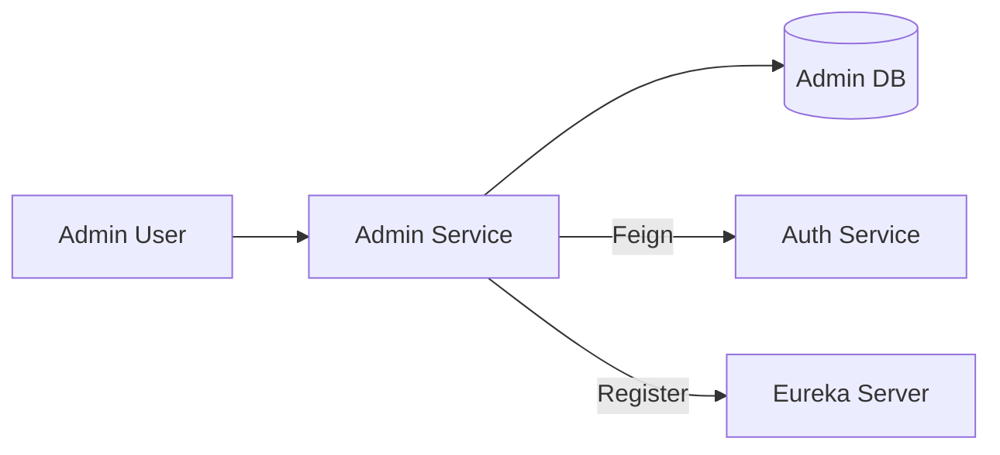

# Admin Service

The **Admin Service** is a core component of the Rental System microservices architecture. It provides administrative capabilities for managing users and processing owner registration requests.

## Features

- **User Management**: Retrieve and filter users by role.
- **Owner Request Management**: Approve or reject requests from users to become owners.
- **Microservice Ready**: Integrated with Eureka for service discovery and Spring Boot Actuator for monitoring.
- **Security**: JWT-based authentication and authorization.

## Technology Stack

- **Java 17**
- **Spring Boot 3.5.7**
- **Spring Data JPA**
- **Spring Security (JWT)**
- **Spring Cloud OpenFeign**
- **Spring Cloud Netflix Eureka**
- **Spring Boot Actuator**
- **H2 Database** (In-memory)
- **Lombok**

## Getting Started

### Prerequisites

- Java 17 or higher
- Maven 3.6+
- Eureka Server (running on `http://localhost:8761`)

### Running the Service

1. Clone the repository.
2. Navigate to the `admin-service` directory.
3. Run the application:
   ```bash
   mvn spring-boot:run
   ```

## API Endpoints

### User Management
- `GET /admin/users`: Get all users (optional query param `role`).
- `GET /admin/users/{userId}`: Get user by ID.

### Owner Request Management
- `GET /admin/owner-requests`: Get all owner registration requests.
- `GET /admin/owner-requests/{requestId}`: Get a specific owner request.
- `PUT /admin/owner-requests/{requestId}/approve`: Approve an owner request.
- `PUT /admin/owner-requests/{requestId}/reject`: Reject an owner request.

### Monitoring
- `GET /actuator/health`: Health check endpoint.
- `GET /actuator/info`: Service information.

## Architecture

The service interacts with the `auth-service` via Feign Clients to manage user roles and retrieve user information. It uses its own database to track owner registration requests.


